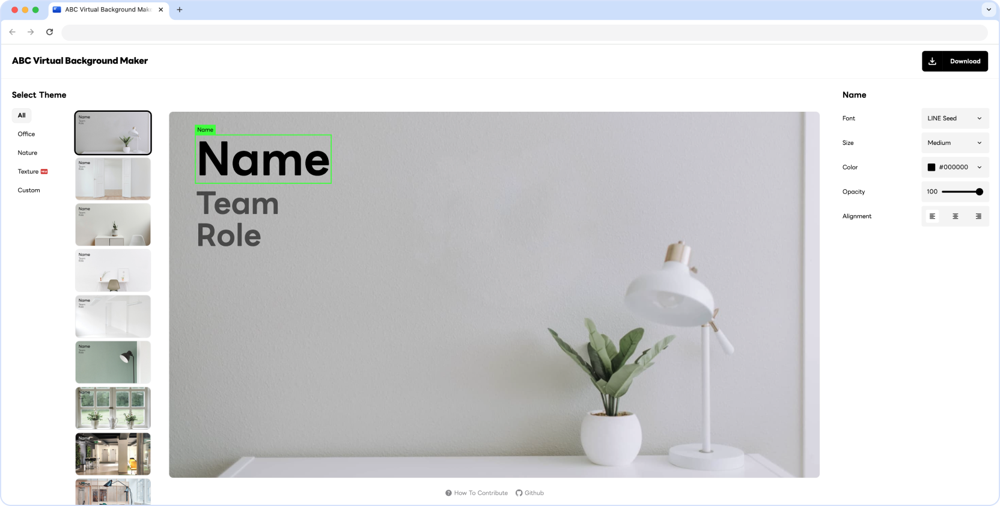
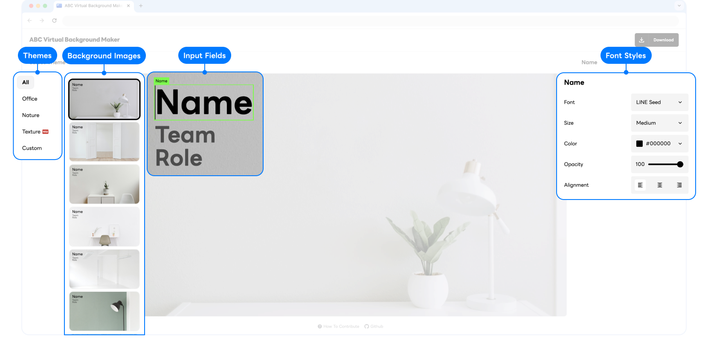

# ABC Virtual Background Maker

A standalone frontend app to generate and download zoom background image with text.



## ✨ Why we created ABC Virtual Background Maker

We recognized the need for a tool that allows teams to personalize their virtual backgrounds with ease, enhancing their professional image and brand identity.

If you've ever found yourself squinting at the screen during a video call, trying to match names to faces as your team grows, or wishing you could make it super easy for partners to spot your name and company, then this app's got your back.

And let's say your company is all about that unified look and drops official backgrounds to keep everyone's vibe on brand – you're going to love this.

## 💡 Features

1. Personalizable Text Overlay - Conveniently add your name, company name, or any other information for Zoom or Teams calls.
1. Adjustable Fonts and Text Placement - Customize fonts and textfields position according to your preferences.
1. Organizable Themes - Create collections of background images, similar to folders, allowing for easy management of virtual backgrounds.
1. Mirror Image Option - Download a reversed version of the image to accommodate video feeds that flip your background horizontally.
1. Image Upload Capability - Beyond using the preloaded backgrounds, users can also upload their own picture to create personalized virtual backgrounds.
1. Custom Brand Colors - Select a key color to align UI with your organization's other sites.
1. No Fuss App - It's a straightforward React web app that doesn't mess around with backend stuff.

## Getting Started

### 🛠️ How to Build

- We recommend using Node.js Version 18+ and `pnpm` [https://pnpm.io/installation](https://pnpm.io/installation)
- Build path: `dist`
- Build Command

  - with local images:

  ```bash
  $ pnpm install && pnpm run read-files && pnpm run build
  ```

  - with CDN images:

  ```bash
  $ pnpm install && pnpm run build
  ```

### 💻 Local Development

1. In the repo folder

   - with local images:

   ```bash
   pnpm install
   pnpm run read-files
   pnpm run dev
   ```

   - with CDN images:

   ```bash
   pnpm install
   pnpm run dev
   ```

2. Dev server will be running at

   ```bash
   http://localhost:5173/
   ```

### 🐳 Container Deployment

We offer a [Dockerfile](Dockerfile) to help you get started quickly. You can execute the Docker commands as follows. It will allow you to access via 8080 port.

```dockerfile
docker build -t abc-virtual-background-maker .
docker run -d -p 8080:80 abc-virtual-background-maker
```

## 🧞‍♂️ How To Customize

Modify `app.config.json`



### 🗂️ Themes

1. Add new object value in `app.config.json` 's `themes`. (Value Type `src/constants/theme.ts`)
2. Set theme name value in new object. (**The theme name should match with the backgrounds subdirectory name.**)

### 🌆 Background Images

- with local images

1. Prepare 16:9 ratio images
2. Set image file name with rgb color with comma `rrr,ggg,bbb` between two dots, only if you need to set text color. (ex. 01.255,255,255.jpg)
3. Add background image files into `/backgrounds/**/*`. (or any other directory and set `backgroundsUri` as relative path.)
4. `pnpm run read-files`
5. `app.config.json` 's `themes`'s `backgrounds` value will be changed automatically.

- with CDN images

1. Prepare 16:9 ratio images urls
2. Set `backgroundsUri` in `app.config.json` as base url.
3. Add `themes`'s `backgrounds` values as object with {src, fontColor?} in `app.config.json` (Value Type `src/constants/image.ts`)

### 📝 Input Fields

- Modify default input fields: Change `defaultInputFields`'s value in `app.config.json` (Value Type `src/constants/input.ts`)

  | `InputFieldGroup`    |                                                                                                                | default            |
  | -------------------- | -------------------------------------------------------------------------------------------------------------- | ------------------ |
  | position             | InputFieldGroup position within the image divided by 3x3 sections. (row-column)                                |                    |
  | fields               | InputField items                                                                                               |                    |
  | direction (optional) | Align InputField items in InputFieldGroup. (`column`: Items are stacked, `row`: Items are laid out in a line.) | `column`           |
  | offset (optional)    | Adjusting detail position from origin point. (Detailed explanation is below)                                   | `{x: '0', y: '0'}` |

  | `InputField`          |                                                                              | default |
  | --------------------- | ---------------------------------------------------------------------------- | ------- |
  | label                 | Label of input (also used as placeholder text)                               |         |
  | fontSize              | Font size of input                                                           |         |
  | fontStyle             | Typography of input                                                          |         |
  | offset                | Adjusting detail position from origin point. (Detailed explanation is below) |         |
  | isRequired (optional) |                                                                              | `false` |
  | text (optional)       | Default value of input                                                       | `""`    |

- Offset

  You can locate textfields by adjusting `offset` values. The value `{"x":"0%", "y": "0%"}` starts from Top-Left corner as the origin point.

  Below table shows reference values according to 1920x1080 or 1280x720 images. Use this table as a guide to approximate the placement of your textfields in pixels.

  | Pixels  | 20% | 40% | 60%  | 80%  |
  | ------- | --- | --- | ---- | ---- |
  | 1920 px | 384 | 768 | 1152 | 1536 |
  | 1080 px | 216 | 432 | 648  | 864  |
  | 1280 px | 256 | 512 | 768  | 1024 |
  | 720 px  | 144 | 288 | 432  | 576  |

- Modify input fields for each theme: Add `themes`'s `inputFields`'s value in `app.config.json`. (It will overwrites `defaultInputFields`.)

  | `Theme`                |                                                                | default |
  | ---------------------- | -------------------------------------------------------------- | ------- |
  | name                   | Theme name should be unique.                                   |         |
  | backgrounds            | Array of images. (Detailed explanation about `Image` is below) |         |
  | inputFields (optional) | Set up an input field group just for this theme                |         |
  | isNew (optional)       | If it's true, new icon shows up next to this theme             | `false` |

  | `Image`              |                                                  | default |
  | -------------------- | ------------------------------------------------ | ------- |
  | src                  | contains the path to the image you want to embed |         |
  | fontColor (optional) | Font color in this image                         |         |
  | theme (optional)     | Which theme does it belong to                    |         |

### 🪄 Font Styles

**To embed google webfonts,**

1. Copy the code into the <head> of `index.html`

```html
<link
  href="https://fonts.googleapis.com/css2?family=Abril+Fatface&family=Alfa+Slab+One&family=Arvo:wght@700&family=Black+Ops+One&family=DM+Sans:opsz,wght@9..40,800&family=DM+Serif+Text&family=Dosis:wght@800&family=Exo:wght@800&family=Gasoek+One&family=Gloock&family=Hanuman:wght@900&family=Inter:wght@800&family=Kalnia:wght@600&family=Lobster&family=Noto+Serif:wght@800&family=Nunito:wght@900&family=Roboto:wght@900&family=Rubik+Bubbles&family=Ultra&family=Zilla+Slab:wght@700&display=swap"
  rel="stylesheet"
/>
```

2. Add `fonts`'s `styles` in `app.config.json`

```json
"styles": [
  "LINE Seed",
  "Inter",
  "Roboto",
  "DM Sans",
  "Exo",
  "Noto Serif",
  "Kalnia",
  "DM Serif Text",
  "Abril Fatface",
  "Gloock",
  "Zilla Slab",
  "Hanuman",
  "Dosis",
  "Alfa Slab One",
  "Arvo",
  "Rubik Bubbles",
  "Ultra",
  "Lobster",
  "Gasoek One",
  "Black Ops One"
]
```

**To embed local webfonts,**

1. Add font file (woff2) in `public`.
2. Add `@font-face` style in `styles/_font.scss`.

```css
@font-face {
  font-weight: 700;
  font-family: "LINE Seed";
  font-style: normal;
  font-stretch: normal;
  src: url("/LINESeedJP_OTF_Bd.woff2") format("woff2");
  font-display: swap;
}
```

3. Add `fonts`'s `styles` as that font-family name in `app.config.json`

### ✏️ Font Sizes

Modify `fonts`'s `sizes` value in `app.config.json`

### 🎨 UI Theme Color

To change the color of the UI elements such as toggles and buttons, you can add the `keyColor` value in `rrr,ggg,bbb` format in the `app.config.json` file. It fosters a consistent design identity for your team.

## 📚 Libraries and Tools

- [React](https://react.dev/)
- [TypeScript](https://www.typescriptlang.org/)
- [Vite](https://vitejs.dev/)
- [html2canvas](https://github.com/niklasvh/html2canvas), [react-draggable](https://github.com/react-grid-layout/react-draggable), [quantize](https://github.com/olivierlesnicki/quantize), [Material Symbols](https://fonts.google.com/icons) and [Unsplash Images](https://unsplash.com/license)
